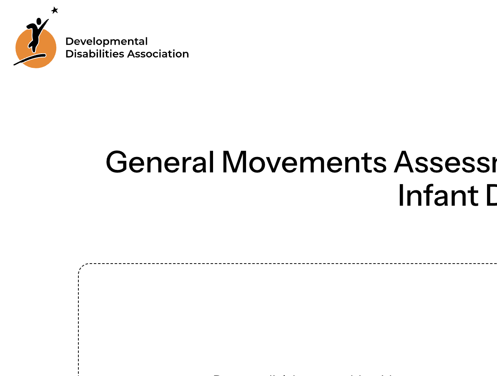
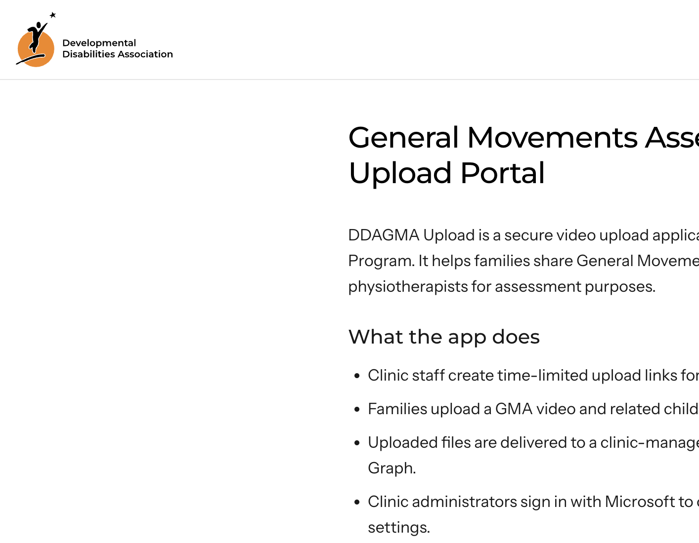

# GMA Parent Upload Portal

A secure web portal for collecting **General Movements Assessment (GMA)** videos from families and delivering them to clinic-owned cloud storage.

It was built by **Marcus Fan** in collaboration with the **Developmental Disabilities Association (DDA)** for the **Vancouver Infant Development Program**. Clinic staff send a private, one-time link. A parent uploads one video from their phone or computer. The file lands in the clinic’s Microsoft 365 storage, named consistently, and staff get an email when it arrives.

## Who it is for

- **Families** who need to share a GMA video without creating an account or installing an app
- **Clinic staff** who currently collect large videos by email, USB, or in-person drop-off
- **GMA-certified physiotherapists** who review those videos for assessment
- **Clinic administrators** who connect the receiving Microsoft 365 location and manage portal settings

The same pattern can collect other single files from people outside an organization — intake documents, signed forms, photos, or recordings — whenever the team wants a private link instead of email attachments.

## What it helps with

Collecting assessment videos is usually slow and messy: large files bounce off email, naming is inconsistent, and staff have to chase missing recordings. This portal is meant to shorten that loop.

- **No parent accounts.** Families open a link and upload. Nothing to register or remember.
- **One file, one use.** Each link is tied to a specific child and stops working after a successful upload.
- **Files stay with the clinic.** Uploads go straight into Microsoft 365 storage the organization already owns — not a third-party vault.
- **Consistent names.** Files are named from the details collected with the video, so they arrive sorted and searchable.
- **Immediate follow-up.** Staff can receive an email with a direct link as soon as a video lands.
- **Phone-friendly.** Parents can upload from the device they already used to record.

## How it works

1. Staff pick a child and create a time-limited upload link.
2. They send that link the same way they already communicate with families.
3. The parent opens it, chooses the date the video was recorded, and uploads one video.
4. The file is stored in the clinic’s connected Microsoft 365 location, and staff are notified.

## Stack

| Layer | Choice |
| --- | --- |
| App | [Next.js](https://nextjs.org/) (App Router) + TypeScript + React |
| UI | Tailwind CSS + [shadcn/ui](https://ui.shadcn.com/) |
| Identity | Microsoft Entra ID (work/school accounts) |
| File destination | Microsoft Graph → OneDrive / SharePoint |
| Link & settings store | Redis (Upstash) |
| Email notifications | Azure Communication Services |

## Documentation

Product docs (how the portal works, who it is for, and the technical building blocks):

**[apps.fenna.tech/secure-upload-portal/docs](https://apps.fenna.tech/secure-upload-portal/docs)**

Overview landing page: [apps.fenna.tech/secure-upload-portal](https://apps.fenna.tech/secure-upload-portal)

In-app public pages: `/info`, `/privacy`, `/tos`.

## Publisher

Marcus Fan in collaboration with the Developmental Disabilities Association.

Support: [support@marcusfan.dev](mailto:support@marcusfan.dev)
